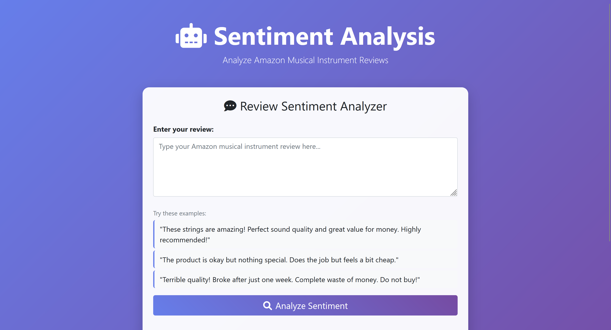
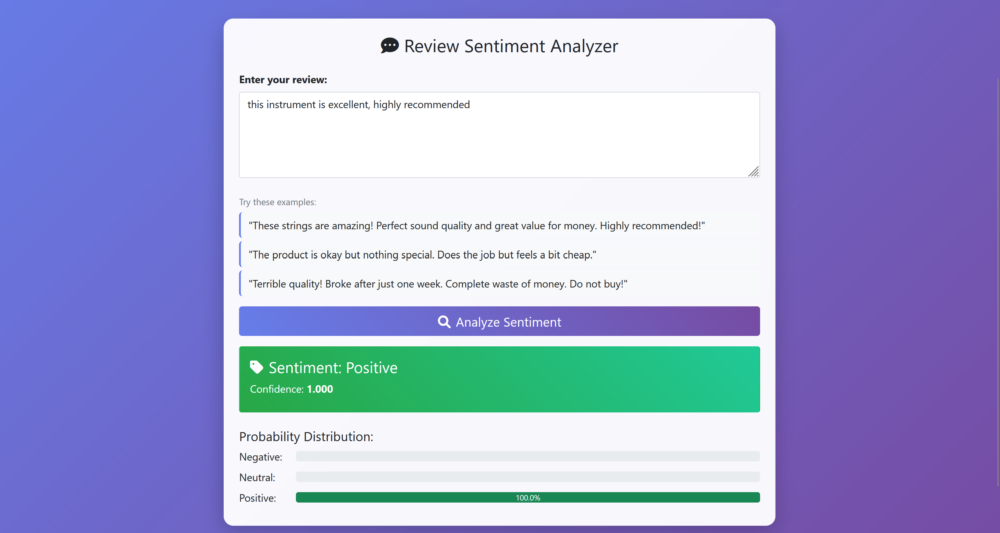

# Amazon Review Sentiment Analyzer

A Flask web application that performs sentiment analysis on Amazon product reviews using machine learning. The model is trained on the [Amazon Musical Instrument Reviews](https://www.kaggle.com/datasets/eswarchandt/amazon-music-reviews) dataset from Kaggle and classifies reviews as **Positive**, **Neutral**, or **Negative** in real time.

---

## 1. Overview

This project demonstrates an end-to-end NLP pipeline — from raw text preprocessing to a deployed web interface. Users can enter any product review and receive an instant sentiment prediction powered by a scikit-learn classifier trained on real Amazon review data.

Training data is sourced from the [Amazon Musical Instrument Reviews](https://www.kaggle.com/datasets/eswarchandt/amazon-music-reviews) dataset on Kaggle. Star ratings are mapped to sentiment labels:

| Rating | Label |
|---|---|
| 4 – 5 stars | Positive |
| 3 stars | Neutral |
| 1 – 2 stars | Negative |

---

## 2. Features

- Real-time sentiment classification (Positive / Neutral / Negative)
- Text preprocessing pipeline using NLTK (tokenization, stopword removal, lemmatization)
- TF-IDF vectorization for feature extraction
- Trained ML model serialized with Joblib for fast inference
- Lightweight Flask web interface

---

## 3. Preview

<!-- Add screenshots here -->
| Home | Sample |
|------|------|
|  |  |

---

## 4. Workflow

1. **Preprocessing** — Raw review text is cleaned, tokenized, and lemmatized using NLTK.
2. **Vectorization** — Processed text is transformed into numerical features via TF-IDF.
3. **Prediction** — The trained scikit-learn model outputs a sentiment label.
4. **Display** — The Flask app renders the result in the browser interface.

---

## 5. Tech Stack

| Layer | Libraries |
|---|---|
| Web framework | Flask |
| Machine learning | scikit-learn, Joblib |
| NLP preprocessing | NLTK |
| Numerical computing | NumPy, SciPy |
| Data manipulation | pandas |
| Terminal output | colorama |

---

## 6. Run Locally

**Prerequisites:** Python 3.7+, pip

1. **Clone the repository**

   ```bash
   git clone https://github.com/ananyakumar2005/amazon-review-classification.git
   cd amazon-review-classification
   ```

2. **Create and activate a virtual environment**

   ```bash
   python -m venv sentiment_env
   ```

   - **Windows:** `sentiment_env\Scripts\activate`
   - **macOS/Linux:** `source sentiment_env/bin/activate`

3. **Install dependencies**

   ```bash
   pip install -r requirements.txt
   ```

4. **Download required NLTK data** *(first run only)*

   ```python
   import nltk
   nltk.download('stopwords')
   nltk.download('wordnet')
   ```

5. **Start the app**

   ```bash
   python final_app.py
   ```

   Open your browser and navigate to [http://localhost:5000](http://localhost:5000).

---

## 7. Project Structure

```
amazon-review-classification/
├── final_app.py              # Flask application entry point
├── model/
│   ├── best_sentiment_model.pkl   # Trained classifier (Joblib)
│   ├── tfidf_vectorizer.pkl       # Fitted TF-IDF vectorizer
│   └── label_encoder.pkl          # Label encoder
├── notebooks/
│   └── training.ipynb        # Model training and evaluation notebook
├── templates/
│   └── index.html            # Web UI
├── requirements.txt
└── README.md
```

---

## License

This project is open source and available under the [MIT License](LICENSE).
